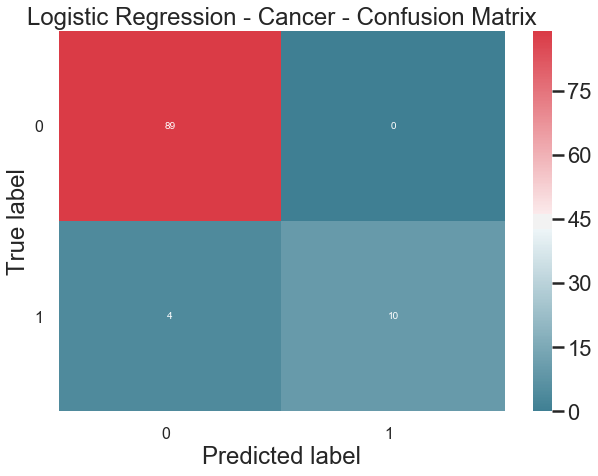
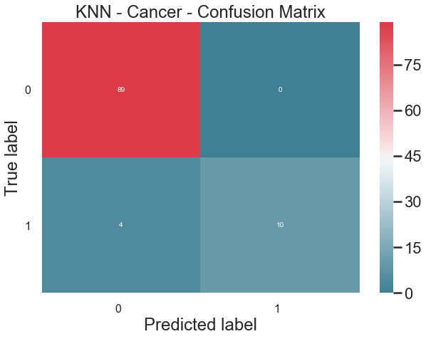
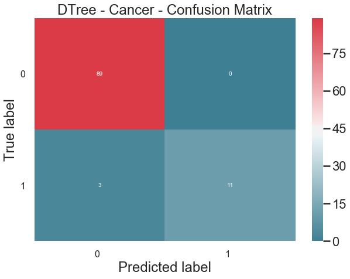
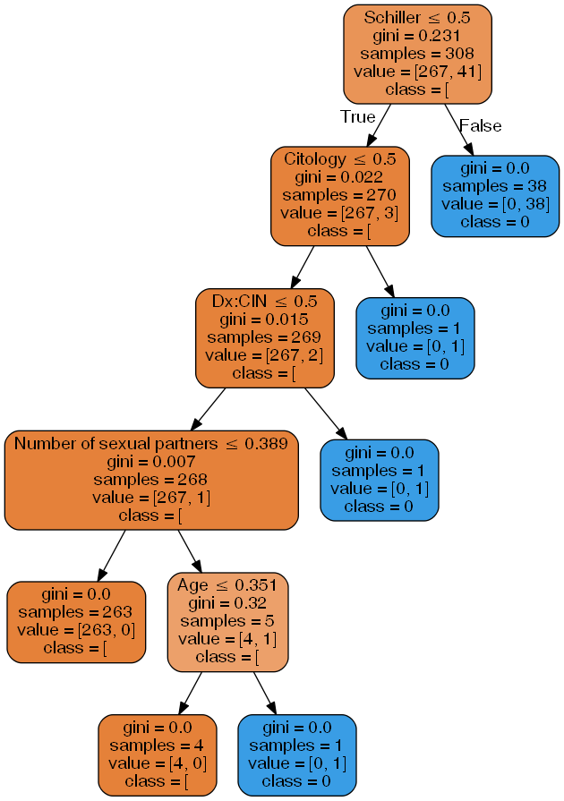

<u>**MACHINE LEARNING EXERCISE: CLASSIFICATION**</u>
# CERVICAL CANCER RISK FACTORS

**Models**
* Logistic Regression
* K-Nearest Neighbors
* Decision tree Classifier

**About**
* The dataset was collected at 'Hospital Universitario de Caracas' in Caracas, Venezuela. The dataset comprises demographic information, habits, and historic medical records of 858 patients. Several patients decided not to answer some of the questions because of privacy concerns (missing values).

**Target Variable**
* (bool) Biopsy: target variable

**Features:**
1. (int) Age 
1. (int) Number of sexual partners 
1. (int) First sexual intercourse (age) 
1. (int) Num of pregnancies 
1. (bool) Smokes 
1. (bool) Smokes (years) 
1. (bool) Smokes (packs/year) 
1. (bool) Hormonal Contraceptives 
1. (int) Hormonal Contraceptives (years) 
1. (bool) IUD 
1. (int) IUD (years) 
1. (bool) STDs 
1. (int) STDs (number) 
1. (bool) STDs:condylomatosis 
1. (bool) STDs:cervical condylomatosis 
1. (bool) STDs:vaginal condylomatosis 
1. (bool) STDs:vulvo-perineal condylomatosis 
1. (bool) STDs:syphilis 
1. (bool) STDs:pelvic inflammatory disease 
1. (bool) STDs:genital herpes 
1. (bool) STDs:molluscum contagiosum 
1. (bool) STDs:AIDS 
1. (bool) STDs:HIV 
1. (bool) STDs:Hepatitis B 
1. (bool) STDs:HPV 
1. (int) STDs: Number of diagnosis 
1. (int) STDs: Time since first diagnosis 
1. (int) STDs: Time since last diagnosis 
1. (bool) Dx:Cancer 
1. (bool) Dx:CIN 
1. (bool) Dx:HPV 
1. (bool) Dx 
1. (bool) Hinselmann: [can also be] target variable 
1. (bool) Schiller: [can also be] target variable 
1. (bool) Cytology: [can also be] target variable 

**Sources:**
* https://www.kaggle.com/loveall/cervical-cancer-risk-classification
* https://archive.ics.uci.edu/ml/datasets/Cervical+cancer+%28Risk+Factors%29#

## Import Libraries


```python
##### Standard Libraries #####
import numpy as np
import pandas as pd
import matplotlib.pyplot as plt
import seaborn as sns
sns.set_style("whitegrid")
sns.set_context("poster")

%matplotlib inline
```


```python
##### Other Libraries #####

## Classification Algorithms ##
from sklearn.neighbors import KNeighborsClassifier
from sklearn.linear_model import LogisticRegression
from sklearn import tree

## For building models ##
from sklearn.model_selection import train_test_split
from sklearn.preprocessing import MinMaxScaler

## For measuring performance ##
from sklearn import metrics
from sklearn.model_selection import cross_val_score

## To visualize decision tree ##
from sklearn.externals.six import StringIO  
from IPython.display import Image  
from sklearn.tree import export_graphviz
import pydotplus
```

 
    

## Load the Dataset


```python
### Load the data
df = pd.read_csv("kag_risk_factors_cervical_cancer_cleaned.csv")
print("Size of dataset:", df.shape)
df.head()
```

    Size of dataset: (411, 34)
    


<div>
<table border="1" class="dataframe">
  <thead>
    <tr style="text-align: right;">
      <th></th>
      <th>Age</th>
      <th>Number of sexual partners</th>
      <th>First sexual intercourse</th>
      <th>Num of pregnancies</th>
      <th>Smokes</th>
      <th>Smokes (years)</th>
      <th>Smokes (packs/year)</th>
      <th>Hormonal Contraceptives</th>
      <th>Hormonal Contraceptives (years)</th>
      <th>IUD</th>
      <th>...</th>
      <th>STDs:HPV</th>
      <th>STDs: Number of diagnosis</th>
      <th>Dx:Cancer</th>
      <th>Dx:CIN</th>
      <th>Dx:HPV</th>
      <th>Dx</th>
      <th>Hinselmann</th>
      <th>Schiller</th>
      <th>Citology</th>
      <th>Biopsy</th>
    </tr>
  </thead>
  <tbody>
    <tr>
      <th>0</th>
      <td>18.0</td>
      <td>4.0</td>
      <td>15.0</td>
      <td>1.0</td>
      <td>0.0</td>
      <td>0.0</td>
      <td>0.0</td>
      <td>0.0</td>
      <td>0.0</td>
      <td>0.0</td>
      <td>...</td>
      <td>0.0</td>
      <td>0.0</td>
      <td>0.0</td>
      <td>0.0</td>
      <td>0.0</td>
      <td>0.0</td>
      <td>0.0</td>
      <td>0.0</td>
      <td>0.0</td>
      <td>0.0</td>
    </tr>
    <tr>
      <th>1</th>
      <td>15.0</td>
      <td>1.0</td>
      <td>14.0</td>
      <td>1.0</td>
      <td>0.0</td>
      <td>0.0</td>
      <td>0.0</td>
      <td>0.0</td>
      <td>0.0</td>
      <td>0.0</td>
      <td>...</td>
      <td>0.0</td>
      <td>0.0</td>
      <td>0.0</td>
      <td>0.0</td>
      <td>0.0</td>
      <td>0.0</td>
      <td>0.0</td>
      <td>0.0</td>
      <td>0.0</td>
      <td>0.0</td>
    </tr>
    <tr>
      <th>2</th>
      <td>34.0</td>
      <td>1.0</td>
      <td>17.0</td>
      <td>1.0</td>
      <td>0.0</td>
      <td>0.0</td>
      <td>0.0</td>
      <td>0.0</td>
      <td>0.0</td>
      <td>0.0</td>
      <td>...</td>
      <td>0.0</td>
      <td>0.0</td>
      <td>0.0</td>
      <td>0.0</td>
      <td>0.0</td>
      <td>0.0</td>
      <td>0.0</td>
      <td>0.0</td>
      <td>0.0</td>
      <td>0.0</td>
    </tr>
    <tr>
      <th>3</th>
      <td>42.0</td>
      <td>3.0</td>
      <td>23.0</td>
      <td>2.0</td>
      <td>0.0</td>
      <td>0.0</td>
      <td>0.0</td>
      <td>0.0</td>
      <td>0.0</td>
      <td>0.0</td>
      <td>...</td>
      <td>0.0</td>
      <td>0.0</td>
      <td>0.0</td>
      <td>0.0</td>
      <td>0.0</td>
      <td>0.0</td>
      <td>0.0</td>
      <td>0.0</td>
      <td>0.0</td>
      <td>0.0</td>
    </tr>
    <tr>
      <th>4</th>
      <td>44.0</td>
      <td>3.0</td>
      <td>26.0</td>
      <td>4.0</td>
      <td>0.0</td>
      <td>0.0</td>
      <td>0.0</td>
      <td>1.0</td>
      <td>2.0</td>
      <td>0.0</td>
      <td>...</td>
      <td>0.0</td>
      <td>0.0</td>
      <td>0.0</td>
      <td>0.0</td>
      <td>0.0</td>
      <td>0.0</td>
      <td>0.0</td>
      <td>0.0</td>
      <td>0.0</td>
      <td>0.0</td>
    </tr>
  </tbody>
</table>
<p>5 rows × 34 columns</p>
</div>


```python
### List of columns with its data type
df.info()
```

    <class 'pandas.core.frame.DataFrame'>
    RangeIndex: 411 entries, 0 to 410
    Data columns (total 34 columns):
    Age                                   411 non-null float64
    Number of sexual partners             411 non-null float64
    First sexual intercourse              411 non-null float64
    Num of pregnancies                    411 non-null float64
    Smokes                                411 non-null float64
    Smokes (years)                        411 non-null float64
    Smokes (packs/year)                   411 non-null float64
    Hormonal Contraceptives               411 non-null float64
    Hormonal Contraceptives (years)       411 non-null float64
    IUD                                   411 non-null float64
    IUD (years)                           411 non-null float64
    STDs                                  411 non-null float64
    STDs (number)                         411 non-null float64
    STDs:condylomatosis                   411 non-null float64
    STDs:cervical condylomatosis          411 non-null float64
    STDs:vaginal condylomatosis           411 non-null float64
    STDs:vulvo-perineal condylomatosis    411 non-null float64
    STDs:syphilis                         411 non-null float64
    STDs:pelvic inflammatory disease      411 non-null float64
    STDs:genital herpes                   411 non-null float64
    STDs:molluscum contagiosum            411 non-null float64
    STDs:AIDS                             411 non-null float64
    STDs:HIV                              411 non-null float64
    STDs:Hepatitis B                      411 non-null float64
    STDs:HPV                              411 non-null float64
    STDs: Number of diagnosis             411 non-null float64
    Dx:Cancer                             411 non-null float64
    Dx:CIN                                411 non-null float64
    Dx:HPV                                411 non-null float64
    Dx                                    411 non-null float64
    Hinselmann                            411 non-null float64
    Schiller                              411 non-null float64
    Citology                              411 non-null float64
    Biopsy                                411 non-null float64
    dtypes: float64(34)
    memory usage: 109.2 KB
    

### Explore the Dataset


```python
### Get the summary of statistics of the data 
df.describe()
```


<div>
<table border="1" class="dataframe">
  <thead>
    <tr style="text-align: right;">
      <th></th>
      <th>Age</th>
      <th>Number of sexual partners</th>
      <th>First sexual intercourse</th>
      <th>Num of pregnancies</th>
      <th>Smokes</th>
      <th>Smokes (years)</th>
      <th>Smokes (packs/year)</th>
      <th>Hormonal Contraceptives</th>
      <th>Hormonal Contraceptives (years)</th>
      <th>IUD</th>
      <th>...</th>
      <th>STDs:HPV</th>
      <th>STDs: Number of diagnosis</th>
      <th>Dx:Cancer</th>
      <th>Dx:CIN</th>
      <th>Dx:HPV</th>
      <th>Dx</th>
      <th>Hinselmann</th>
      <th>Schiller</th>
      <th>Citology</th>
      <th>Biopsy</th>
    </tr>
  </thead>
  <tbody>
    <tr>
      <th>count</th>
      <td>411.000000</td>
      <td>411.000000</td>
      <td>411.000000</td>
      <td>411.000000</td>
      <td>411.000000</td>
      <td>411.000000</td>
      <td>411.000000</td>
      <td>411.000000</td>
      <td>411.000000</td>
      <td>411.000000</td>
      <td>...</td>
      <td>411.0</td>
      <td>411.000000</td>
      <td>411.000000</td>
      <td>411.000000</td>
      <td>411.000000</td>
      <td>411.000000</td>
      <td>411.000000</td>
      <td>411.000000</td>
      <td>411.000000</td>
      <td>411.000000</td>
    </tr>
    <tr>
      <th>mean</th>
      <td>25.883212</td>
      <td>2.155718</td>
      <td>17.411192</td>
      <td>2.014599</td>
      <td>0.048662</td>
      <td>0.351097</td>
      <td>0.095423</td>
      <td>0.666667</td>
      <td>1.635693</td>
      <td>0.029197</td>
      <td>...</td>
      <td>0.0</td>
      <td>0.026764</td>
      <td>0.014599</td>
      <td>0.007299</td>
      <td>0.014599</td>
      <td>0.017032</td>
      <td>0.060827</td>
      <td>0.116788</td>
      <td>0.043796</td>
      <td>0.133820</td>
    </tr>
    <tr>
      <th>std</th>
      <td>7.362462</td>
      <td>1.075258</td>
      <td>2.745954</td>
      <td>1.117393</td>
      <td>0.215422</td>
      <td>2.434709</td>
      <td>0.852453</td>
      <td>0.471979</td>
      <td>2.848869</td>
      <td>0.168564</td>
      <td>...</td>
      <td>0.0</td>
      <td>0.161590</td>
      <td>0.120085</td>
      <td>0.085227</td>
      <td>0.120085</td>
      <td>0.129547</td>
      <td>0.239304</td>
      <td>0.321559</td>
      <td>0.204889</td>
      <td>0.340874</td>
    </tr>
    <tr>
      <th>min</th>
      <td>14.000000</td>
      <td>1.000000</td>
      <td>11.000000</td>
      <td>0.000000</td>
      <td>0.000000</td>
      <td>0.000000</td>
      <td>0.000000</td>
      <td>0.000000</td>
      <td>0.000000</td>
      <td>0.000000</td>
      <td>...</td>
      <td>0.0</td>
      <td>0.000000</td>
      <td>0.000000</td>
      <td>0.000000</td>
      <td>0.000000</td>
      <td>0.000000</td>
      <td>0.000000</td>
      <td>0.000000</td>
      <td>0.000000</td>
      <td>0.000000</td>
    </tr>
    <tr>
      <th>25%</th>
      <td>20.000000</td>
      <td>1.000000</td>
      <td>15.000000</td>
      <td>1.000000</td>
      <td>0.000000</td>
      <td>0.000000</td>
      <td>0.000000</td>
      <td>0.000000</td>
      <td>0.000000</td>
      <td>0.000000</td>
      <td>...</td>
      <td>0.0</td>
      <td>0.000000</td>
      <td>0.000000</td>
      <td>0.000000</td>
      <td>0.000000</td>
      <td>0.000000</td>
      <td>0.000000</td>
      <td>0.000000</td>
      <td>0.000000</td>
      <td>0.000000</td>
    </tr>
    <tr>
      <th>50%</th>
      <td>25.000000</td>
      <td>2.000000</td>
      <td>17.000000</td>
      <td>2.000000</td>
      <td>0.000000</td>
      <td>0.000000</td>
      <td>0.000000</td>
      <td>1.000000</td>
      <td>0.500000</td>
      <td>0.000000</td>
      <td>...</td>
      <td>0.0</td>
      <td>0.000000</td>
      <td>0.000000</td>
      <td>0.000000</td>
      <td>0.000000</td>
      <td>0.000000</td>
      <td>0.000000</td>
      <td>0.000000</td>
      <td>0.000000</td>
      <td>0.000000</td>
    </tr>
    <tr>
      <th>75%</th>
      <td>30.000000</td>
      <td>3.000000</td>
      <td>18.000000</td>
      <td>3.000000</td>
      <td>0.000000</td>
      <td>0.000000</td>
      <td>0.000000</td>
      <td>1.000000</td>
      <td>2.000000</td>
      <td>0.000000</td>
      <td>...</td>
      <td>0.0</td>
      <td>0.000000</td>
      <td>0.000000</td>
      <td>0.000000</td>
      <td>0.000000</td>
      <td>0.000000</td>
      <td>0.000000</td>
      <td>0.000000</td>
      <td>0.000000</td>
      <td>0.000000</td>
    </tr>
    <tr>
      <th>max</th>
      <td>52.000000</td>
      <td>10.000000</td>
      <td>29.000000</td>
      <td>8.000000</td>
      <td>1.000000</td>
      <td>34.000000</td>
      <td>15.000000</td>
      <td>1.000000</td>
      <td>20.000000</td>
      <td>1.000000</td>
      <td>...</td>
      <td>0.0</td>
      <td>1.000000</td>
      <td>1.000000</td>
      <td>1.000000</td>
      <td>1.000000</td>
      <td>1.000000</td>
      <td>1.000000</td>
      <td>1.000000</td>
      <td>1.000000</td>
      <td>1.000000</td>
    </tr>
  </tbody>
</table>
<p>8 rows × 34 columns</p>
</div>


```python
### Determine the distribution of values
df["Biopsy"].value_counts()
```


    0.0    356
    1.0     55
    Name: Biopsy, dtype: int64


As seen on the value counts above, the data is not balanced. Because of this, the models will more likely predict *0.0* more accurately than *1.0*.


```python
### Get correlation of features
df.corr()["Biopsy"].sort_values(ascending=False)
```


    Biopsy                                1.000000
    Schiller                              0.925147
    Hinselmann                            0.647471
    Citology                              0.544482
    STDs                                  0.441213
    STDs: Number of diagnosis             0.421900
    STDs (number)                         0.412472
    STDs:condylomatosis                   0.334890
    STDs:vulvo-perineal condylomatosis    0.334890
    Dx                                    0.334890
    IUD                                   0.313868
    Dx:HPV                                0.309665
    Dx:Cancer                             0.309665
    Smokes (years)                        0.290817
    STDs:HIV                              0.282336
    Smokes (packs/year)                   0.257391
    IUD (years)                           0.253451
    Smokes                                0.243252
    Hormonal Contraceptives (years)       0.232390
    Dx:CIN                                0.218160
    Num of pregnancies                    0.161349
    Age                                   0.147161
    Number of sexual partners             0.129332
    STDs:genital herpes                   0.125647
    Hormonal Contraceptives              -0.010107
    First sexual intercourse             -0.048507
    STDs:cervical condylomatosis               NaN
    STDs:vaginal condylomatosis                NaN
    STDs:syphilis                              NaN
    STDs:pelvic inflammatory disease           NaN
    STDs:molluscum contagiosum                 NaN
    STDs:AIDS                                  NaN
    STDs:Hepatitis B                           NaN
    STDs:HPV                                   NaN
    Name: Biopsy, dtype: float64


The features *Schiller*, *Hinselmann*, *Citology* and *STDS* may more likely to be the top predictors for this dataset because of its high correlation with the target variable *Biopsy*. 

Meanwhile, the features with *NaN* correlation with *Biopsy* are the columns with only one distinct value, as shown below.


```python
### List columns with only 1 distinct value
print([col for col in df.columns if df[col].value_counts().shape[0] == 1])
```

    ['STDs:cervical condylomatosis', 'STDs:vaginal condylomatosis', 'STDs:syphilis', 'STDs:pelvic inflammatory disease', 'STDs:molluscum contagiosum', 'STDs:AIDS', 'STDs:Hepatitis B', 'STDs:HPV']
    

## Prepare the Data for Modelling

First, separate the predictor columns and the target variable. Also, drop the columns with *NaN* correlation with the target variable *Biopsy* since it will not contribute on the improvement of the models.


```python
### Separate the predictor columns and the target variable
#### Predictors
X = df.drop(["STDs:cervical condylomatosis", "STDs:vaginal condylomatosis", "STDs:syphilis",
              "STDs:pelvic inflammatory disease", "STDs:molluscum contagiosum", "STDs:AIDS",
              "STDs:Hepatitis B", "STDs:HPV", "Biopsy"], axis=1)

#### Target
y = df["Biopsy"]

print("Shape of X:", X.shape, "\nShape of y:", y.shape)
```

    Shape of X: (411, 25) 
    Shape of y: (411,)
    

### Train-Test Split


```python
### Split the dataset into training and test sets
X_train, X_test, y_train, y_test = train_test_split(X, y, test_size=0.25, random_state=12)

### Check if properly split
print("Shape of X_train:", X_train.shape, "\tShape of X_test:", X_test.shape, 
      "\nShape of y_train:", y_train.shape, "\tShape of y_test:", y_test.shape)
```

    Shape of X_train: (308, 25) 	Shape of X_test: (103, 25) 
    Shape of y_train: (308,) 	Shape of y_test: (103,)
    

### Scaling the data using MinMax Scaler
This is performed to make the magnitude of the data more uniform and consistent.


```python
### Instantiate the MinMax Scaler
minmax = MinMaxScaler()

### Fit the scaler to the training set
minmax.fit(X_train)

### Transform the training set
X_train_scaled = minmax.transform(X_train)

### Transform the test set
X_test_scaled = minmax.transform(X_test)
```


```python
### For cross validation - whole dataset

#### Fit the scaler
minmax.fit(X)

#### Transform the training set
X_cv_scaled = minmax.transform(X)
```


```python
### Change to Pandas dataframe for easier viewing and manipulation of the data
X_train_sdf = pd.DataFrame(X_train_scaled, index=X_train.index, columns=X_train.columns)
X_test_sdf = pd.DataFrame(X_test_scaled, index=X_test.index, columns=X_test.columns)
X_cv_sdf = pd.DataFrame(X_cv_scaled, index=X.index, columns=X.columns)
```

## Build the Models


```python
### Create a method to plot the confusion matrix for easier viewing
def confmatrix(predicted, title):
    cm = metrics.confusion_matrix(y_test, predicted)

    df_cm = pd.DataFrame(cm, index=[0,1], columns=[0,1])

    fig = plt.figure(figsize= (10,7))
    cmap = sns.diverging_palette(220, 10, as_cmap=True)
    heatmap = sns.heatmap(df_cm,annot=True, fmt="d", cmap=cmap)
    heatmap.yaxis.set_ticklabels(heatmap.yaxis.get_ticklabels(), rotation=0, ha='right', fontsize=16)
    heatmap.xaxis.set_ticklabels(heatmap.xaxis.get_ticklabels(), rotation=0, ha='right', fontsize=16)
    plt.title(title)
    plt.ylabel("True label")
    plt.xlabel("Predicted label")
```

### Logistic Regression

#### Build/Train the Logistic Regression model


```python
### Instantiate the Algorithm 
logreg = LogisticRegression()

### Train/Fit the model
logreg.fit(X_train_sdf, y_train)
```

    LogisticRegression(C=1.0, class_weight=None, dual=False, fit_intercept=True,
                       intercept_scaling=1, l1_ratio=None, max_iter=100,
                       multi_class='warn', n_jobs=None, penalty='l2',
                       random_state=None, solver='warn', tol=0.0001, verbose=0,
                       warm_start=False)


#### Identify feature importance based on the Logistic Regression model


```python
### Check the Trained Model Coefficients
coef = pd.DataFrame(X_train_sdf.columns, columns=["Features"])
coef["Coef"] = logreg.coef_.reshape(-1,1)
coef["| Coef |"] = np.abs(coef["Coef"])
coef.sort_values(by="| Coef |", ascending=False)
```


<div>
<table border="1" class="dataframe">
  <thead>
    <tr style="text-align: right;">
      <th></th>
      <th>Features</th>
      <th>Coef</th>
      <th>| Coef |</th>
    </tr>
  </thead>
  <tbody>
    <tr>
      <th>23</th>
      <td>Schiller</td>
      <td>3.899563</td>
      <td>3.899563</td>
    </tr>
    <tr>
      <th>24</th>
      <td>Citology</td>
      <td>1.624006</td>
      <td>1.624006</td>
    </tr>
    <tr>
      <th>22</th>
      <td>Hinselmann</td>
      <td>1.380271</td>
      <td>1.380271</td>
    </tr>
    <tr>
      <th>2</th>
      <td>First sexual intercourse</td>
      <td>-0.930836</td>
      <td>0.930836</td>
    </tr>
    <tr>
      <th>21</th>
      <td>Dx</td>
      <td>0.885809</td>
      <td>0.885809</td>
    </tr>
    <tr>
      <th>19</th>
      <td>Dx:CIN</td>
      <td>0.805565</td>
      <td>0.805565</td>
    </tr>
    <tr>
      <th>7</th>
      <td>Hormonal Contraceptives</td>
      <td>-0.574310</td>
      <td>0.574310</td>
    </tr>
    <tr>
      <th>9</th>
      <td>IUD</td>
      <td>0.552896</td>
      <td>0.552896</td>
    </tr>
    <tr>
      <th>8</th>
      <td>Hormonal Contraceptives (years)</td>
      <td>0.431498</td>
      <td>0.431498</td>
    </tr>
    <tr>
      <th>1</th>
      <td>Number of sexual partners</td>
      <td>0.422697</td>
      <td>0.422697</td>
    </tr>
    <tr>
      <th>11</th>
      <td>STDs</td>
      <td>0.323547</td>
      <td>0.323547</td>
    </tr>
    <tr>
      <th>17</th>
      <td>STDs: Number of diagnosis</td>
      <td>0.287534</td>
      <td>0.287534</td>
    </tr>
    <tr>
      <th>10</th>
      <td>IUD (years)</td>
      <td>0.267958</td>
      <td>0.267958</td>
    </tr>
    <tr>
      <th>4</th>
      <td>Smokes</td>
      <td>0.261781</td>
      <td>0.261781</td>
    </tr>
    <tr>
      <th>12</th>
      <td>STDs (number)</td>
      <td>0.252504</td>
      <td>0.252504</td>
    </tr>
    <tr>
      <th>0</th>
      <td>Age</td>
      <td>-0.230098</td>
      <td>0.230098</td>
    </tr>
    <tr>
      <th>18</th>
      <td>Dx:Cancer</td>
      <td>0.189293</td>
      <td>0.189293</td>
    </tr>
    <tr>
      <th>20</th>
      <td>Dx:HPV</td>
      <td>0.189293</td>
      <td>0.189293</td>
    </tr>
    <tr>
      <th>14</th>
      <td>STDs:vulvo-perineal condylomatosis</td>
      <td>0.181461</td>
      <td>0.181461</td>
    </tr>
    <tr>
      <th>13</th>
      <td>STDs:condylomatosis</td>
      <td>0.181461</td>
      <td>0.181461</td>
    </tr>
    <tr>
      <th>5</th>
      <td>Smokes (years)</td>
      <td>0.178782</td>
      <td>0.178782</td>
    </tr>
    <tr>
      <th>6</th>
      <td>Smokes (packs/year)</td>
      <td>0.157158</td>
      <td>0.157158</td>
    </tr>
    <tr>
      <th>16</th>
      <td>STDs:HIV</td>
      <td>0.142086</td>
      <td>0.142086</td>
    </tr>
    <tr>
      <th>3</th>
      <td>Num of pregnancies</td>
      <td>-0.141888</td>
      <td>0.141888</td>
    </tr>
    <tr>
      <th>15</th>
      <td>STDs:genital herpes</td>
      <td>0.000000</td>
      <td>0.000000</td>
    </tr>
  </tbody>
</table>
</div>


Based on the magnitude of the coefficients, *Schiller*, *Citology*, *Hinselmann* and *First sexual intercourse* are the top predictors for this model.

Notice that the predictor *First sexual intercourse* has the lowest correlation with *Biopsy*. This just shows that correlation should not always be the main basis on identifying top predictors, especially in classification.

#### Validate the Logistic Regression model


```python
### Make Predictions
logreg_pred = logreg.predict(X_test_sdf)
```


```python
### Get the metrics to test performance
logreg_score = metrics.accuracy_score(y_test,logreg_pred) * 100
logreg_recall = metrics.recall_score(y_test, logreg_pred) * 100

### Print Classification report
print("Classification report for classifier %s:\n%s\n"
      % (logreg, metrics.classification_report(y_test, logreg_pred)))

print("Accuracy Score:", logreg_score)
```

    Classification report for classifier LogisticRegression(C=1.0, class_weight=None, dual=False, fit_intercept=True,
                       intercept_scaling=1, l1_ratio=None, max_iter=100,
                       multi_class='warn', n_jobs=None, penalty='l2',
                       random_state=None, solver='warn', tol=0.0001, verbose=0,
                       warm_start=False):
                  precision    recall  f1-score   support
    
             0.0       0.96      1.00      0.98        89
             1.0       1.00      0.71      0.83        14
    
        accuracy                           0.96       103
       macro avg       0.98      0.86      0.91       103
    weighted avg       0.96      0.96      0.96       103
    
    
    Accuracy Score: 96.11650485436894
    

This model has a high **accuracy = 98%** and a decent **recall = 71%**.

This confusion matrix shows that the model predicts *0.0* more accurately as expected. 


```python
### Plot the confusion matrix
confmatrix(logreg_pred,"Logistic Regression - Cancer - Confusion Matrix")
```





#### Cross-validation of the Logistic Regression model


```python
### Perform cross-validation then get the mean
logreg_cv = np.mean(cross_val_score(logreg, X_cv_sdf, y, cv=10)) * 100
print("Cross-Validation Scorev (10 folds):", logreg_cv)
```

    Cross-Validation Scorev (10 folds): 98.29761904761905
    


    

### K-Nearest Neighbor

#### Build/Train the KNN Model


```python
### Finding the best K

best_k = 0
best_score = 0

for k in range(3,200,2):
    ### Instantiate the model
    knn = KNeighborsClassifier(n_neighbors=k)

    ### Fit the model to the training set
    knn.fit(X_train_sdf,y_train)
    
    ### Predict on the Test Set
    knn_pred = knn.predict(X_test_sdf)

    ### Get accuracy
    score = metrics.accuracy_score(y_test,knn_pred) * 100
    
    if score >= best_score and k >= best_k:
        best_score = score
        best_k = k

### Print the best score and k
print("---Best results---\nK:", best_k, "\nScore:", best_score)
```

    ---Best results---
    K: 3 
    Score: 96.11650485436894
    


```python
### Build final model using the best K 
### Set the value of K
k = best_k

### Instantiate the model
knn = KNeighborsClassifier(n_neighbors=k)

### Fit the model to the training set
knn.fit(X_train_sdf,y_train)

### Predict on the Test Set
knn_pred = knn.predict(X_test_sdf)
```

#### Validate the KNN model


```python
### Predict on the Test Set
knn_pred = knn.predict(X_test_sdf)
```


```python
### Get the metrics to test performance
knn_score = metrics.accuracy_score(y_test, knn_pred) * 100
knn_recall = metrics.recall_score(y_test, knn_pred) * 100

### Print Classification report
print("Classification report for classifier %s:\n%s\n"
      % (knn, metrics.classification_report(y_test, knn_pred)))

print("Accuracy Score:", knn_score)
```

    Classification report for classifier KNeighborsClassifier(algorithm='auto', leaf_size=30, metric='minkowski',
                         metric_params=None, n_jobs=None, n_neighbors=3, p=2,
                         weights='uniform'):
                  precision    recall  f1-score   support
    
             0.0       0.96      1.00      0.98        89
             1.0       1.00      0.71      0.83        14
    
        accuracy                           0.96       103
       macro avg       0.98      0.86      0.91       103
    weighted avg       0.96      0.96      0.96       103
    
    
    Accuracy Score: 96.11650485436894
    

This model also has a high **accuracy = 96%** and a decent **recall = 71%**.

This confusion matrix shows that the model predicts *0.0* more accurately as expected. 


```python
### Plot the confusion matrix for easier viewing
confmatrix(knn_pred,"KNN - Cancer - Confusion Matrix")
```





#### Cross-validation of the KNN model


```python
### Perform cross-validation then get the mean
knn_cv = np.mean(cross_val_score(knn, X_cv_sdf, y, cv=10)) * 100
print("Cross-validation score (10 folds):", knn_cv)
```

    Cross-validation score (10 folds): 98.05952380952381
    

### Decision Tree Classifier

#### Build/Train the Decision Tree model


```python
### Instantiate the Algorithm
dtree = tree.DecisionTreeClassifier() #criterion="gini", min_samples_split=2, min_samples_leaf=1, random_state=12)

### Train the model
dtree.fit(X_train_sdf,y_train)
```


    DecisionTreeClassifier(class_weight=None, criterion='gini', max_depth=None,
                           max_features=None, max_leaf_nodes=None,
                           min_impurity_decrease=0.0, min_impurity_split=None,
                           min_samples_leaf=1, min_samples_split=2,
                           min_weight_fraction_leaf=0.0, presort=False,
                           random_state=None, splitter='best')


#### Validate the Decision Tree model


```python
### Make predictions
dtree_pred = dtree.predict(X_test_sdf)
```


```python
### Get the metrics to test performance
dtree_score = metrics.accuracy_score(y_test, dtree_pred) * 100
dtree_recall = metrics.recall_score(y_test, dtree_pred) * 100

### Print Classification report
print("Classification report for classifier %s:\n%s\n"
      % (dtree, metrics.classification_report(y_test, dtree_pred)))

print("Accuracy Score:", dtree_score)
```

    Classification report for classifier DecisionTreeClassifier(class_weight=None, criterion='gini', max_depth=None,
                           max_features=None, max_leaf_nodes=None,
                           min_impurity_decrease=0.0, min_impurity_split=None,
                           min_samples_leaf=1, min_samples_split=2,
                           min_weight_fraction_leaf=0.0, presort=False,
                           random_state=None, splitter='best'):
                  precision    recall  f1-score   support
    
             0.0       0.97      1.00      0.98        89
             1.0       1.00      0.79      0.88        14
    
        accuracy                           0.97       103
       macro avg       0.98      0.89      0.93       103
    weighted avg       0.97      0.97      0.97       103
    
    
    Accuracy Score: 97.0873786407767
    

The **97% accuracy score** of this model is also high. This model also has highest **recall of 78%** compared to the other models tried in this notebook. 

Shown below is the confusion matrix.


```python
### Plot the confusion matrix for easier viewing
confmatrix(dtree_pred,"DTree - Cancer - Confusion Matrix")
```





#### Visualize Decision Tree model


```python
### Visualize Decision Tree
feature_col = X_train.columns
class_col = pd.unique(y_train)
class_col = np.array(class_col)
class_col = str(class_col).replace(" ", "")

dot_data = StringIO()
export_graphviz(dtree, out_file=dot_data,  
                filled=True, rounded=True,
                special_characters=True,
               feature_names=feature_col,
               class_names=class_col)
graph = pydotplus.graph_from_dot_data(dot_data.getvalue())  
Image(graph.create_png())
```





```python
pd.DataFrame(dtree.feature_importances_, index = X_train.columns, 
             columns=["Importance"]).sort_values(by="Importance", ascending=False)
```


<div>
<table border="1" class="dataframe">
  <thead>
    <tr style="text-align: right;">
      <th></th>
      <th>Importance</th>
    </tr>
  </thead>
  <tbody>
    <tr>
      <th>Schiller</th>
      <td>0.916531</td>
    </tr>
    <tr>
      <th>Dx:CIN</th>
      <td>0.027822</td>
    </tr>
    <tr>
      <th>Citology</th>
      <td>0.027616</td>
    </tr>
    <tr>
      <th>Age</th>
      <td>0.022508</td>
    </tr>
    <tr>
      <th>Number of sexual partners</th>
      <td>0.005522</td>
    </tr>
    <tr>
      <th>Smokes</th>
      <td>0.000000</td>
    </tr>
    <tr>
      <th>STDs:genital herpes</th>
      <td>0.000000</td>
    </tr>
    <tr>
      <th>First sexual intercourse</th>
      <td>0.000000</td>
    </tr>
    <tr>
      <th>Hinselmann</th>
      <td>0.000000</td>
    </tr>
    <tr>
      <th>Dx</th>
      <td>0.000000</td>
    </tr>
    <tr>
      <th>Dx:HPV</th>
      <td>0.000000</td>
    </tr>
    <tr>
      <th>Num of pregnancies</th>
      <td>0.000000</td>
    </tr>
    <tr>
      <th>Dx:Cancer</th>
      <td>0.000000</td>
    </tr>
    <tr>
      <th>STDs: Number of diagnosis</th>
      <td>0.000000</td>
    </tr>
    <tr>
      <th>STDs:HIV</th>
      <td>0.000000</td>
    </tr>
    <tr>
      <th>STDs:vulvo-perineal condylomatosis</th>
      <td>0.000000</td>
    </tr>
    <tr>
      <th>Smokes (years)</th>
      <td>0.000000</td>
    </tr>
    <tr>
      <th>STDs:condylomatosis</th>
      <td>0.000000</td>
    </tr>
    <tr>
      <th>STDs</th>
      <td>0.000000</td>
    </tr>
    <tr>
      <th>IUD (years)</th>
      <td>0.000000</td>
    </tr>
    <tr>
      <th>IUD</th>
      <td>0.000000</td>
    </tr>
    <tr>
      <th>Hormonal Contraceptives (years)</th>
      <td>0.000000</td>
    </tr>
    <tr>
      <th>Hormonal Contraceptives</th>
      <td>0.000000</td>
    </tr>
    <tr>
      <th>Smokes (packs/year)</th>
      <td>0.000000</td>
    </tr>
    <tr>
      <th>STDs (number)</th>
      <td>0.000000</td>
    </tr>
  </tbody>
</table>
</div>


The Decision Tree model only used five predictors but still got high accuracy and recall. 

All of the predictors for this model are same as the top predictors of the Logistic Regression model except for **Num of pregnancies** and **Number of sexual partners**. 

#### Cross-validation of the Decision Tree model


```python
### Perform cross-validation
dtree_cv = np.mean(cross_val_score(dtree, X_cv_sdf, y, cv=10)) * 100
print("Cross-validation score (10 folds):", dtree_cv)
```

    Cross-validation score (10 folds): 98.04761904761905
    

## Summary of Results


```python
summary = pd.DataFrame(index=["K-Nearest Neighbor", "Logistic Regression", "Decision Tree Classifier"],
                       columns=["Accuracy Score", "Recall", "Cross-Validation Score"], 
                       data=[[knn_score, knn_recall, knn_cv], [logreg_score, logreg_recall, logreg_cv],
                             [dtree_score, dtree_recall, dtree_cv]])
summary
```


<div>
<table border="1" class="dataframe">
  <thead>
    <tr style="text-align: right;">
      <th></th>
      <th>Accuracy Score</th>
      <th>Recall</th>
      <th>Cross-Validation Score</th>
    </tr>
  </thead>
  <tbody>
    <tr>
      <th>K-Nearest Neighbor</th>
      <td>96.116505</td>
      <td>71.428571</td>
      <td>98.059524</td>
    </tr>
    <tr>
      <th>Logistic Regression</th>
      <td>96.116505</td>
      <td>71.428571</td>
      <td>98.297619</td>
    </tr>
    <tr>
      <th>Decision Tree Classifier</th>
      <td>97.087379</td>
      <td>78.571429</td>
      <td>98.047619</td>
    </tr>
  </tbody>
</table>
</div>


Out of all the models tried, **the Decision Tree Classifier performed the best compared to the others because of its high accuracy and recall**.

The Decision Tree Classifier may have a slightly lower cross-validation score, but its high recall score makes it a better fit for this use case because **it is more favorable to incorrectly classify someone with a disease to perform more tests rather than missing someone that actually has a disease**.

It is highly recommended to gather more data for a more balanced dataset and try more advanced models. Also, it is recommended to try to fine tune these models since the parameters used here are all default.

## Special Thanks
* [FTW Foundation](http://www.ftwfoundation.org)
